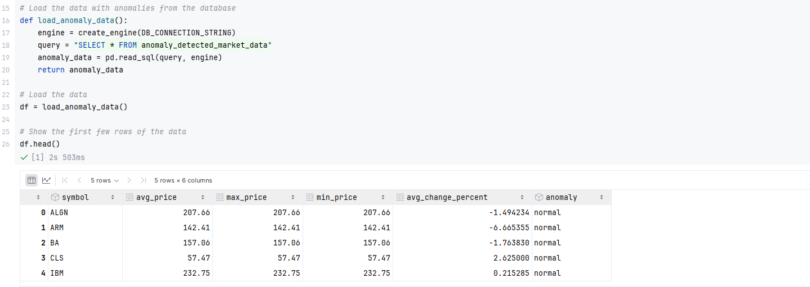
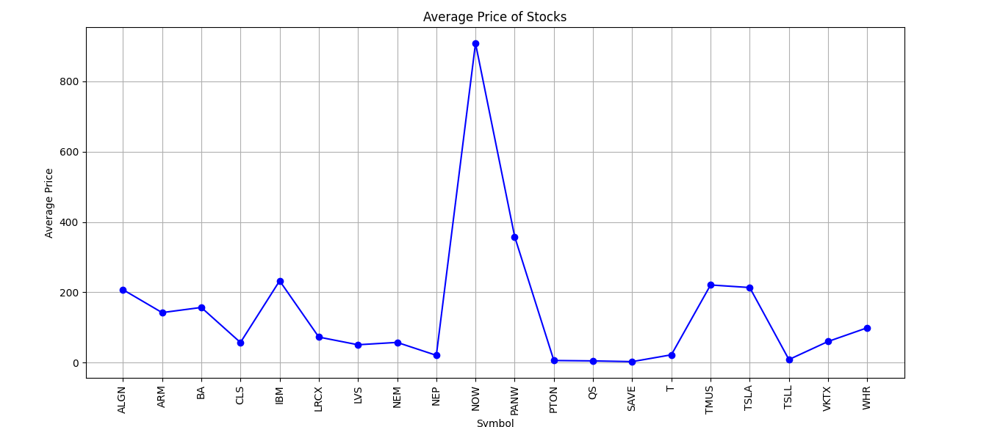
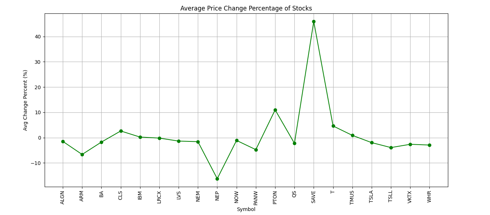
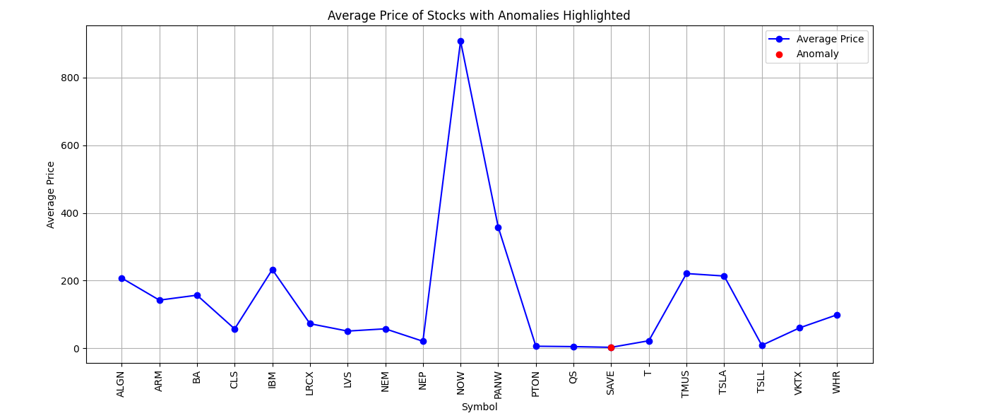
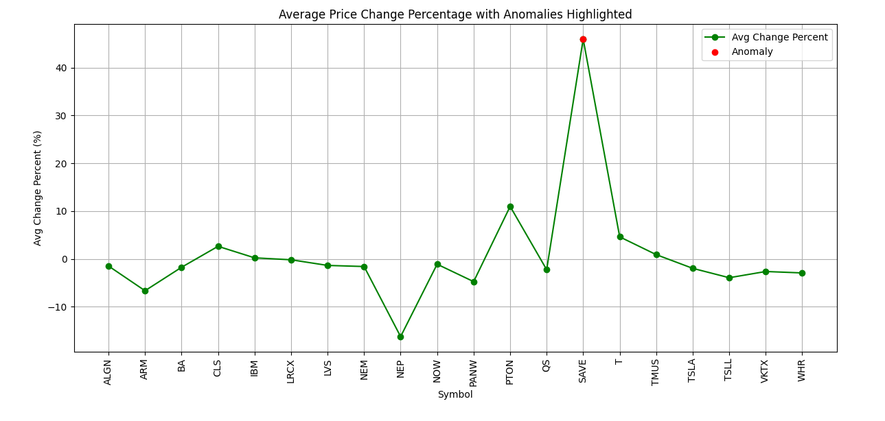
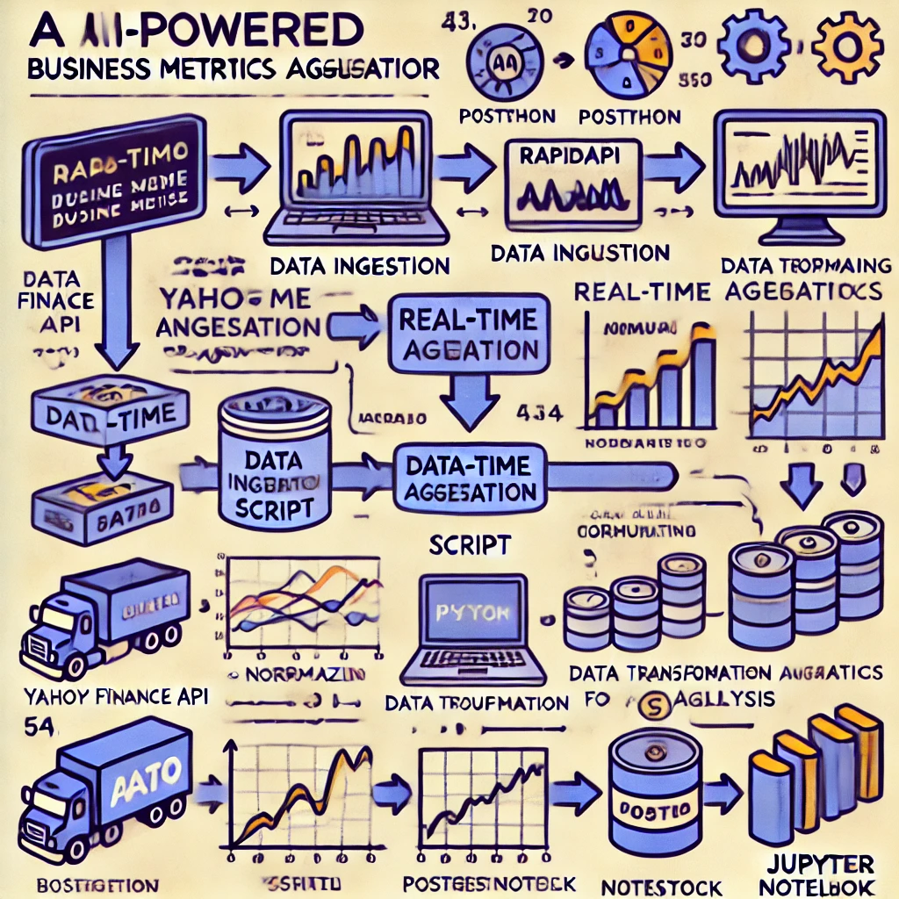

# AI-Powered Real-Time Business Metrics Aggregator

## Project Overview

This project demonstrates a pipeline for aggregating and analyzing business metrics. The system processes stock data, detects anomalies, and applies data transformation, cleaning, and aggregation techniques using Python and SQL. The project uses PostgreSQL for storing and querying business metrics.

### Key Components:

1. **Data Ingestion**: Fetching business metrics from Yahoo Finance API through RapidAPI and storing them in PostgreSQL.
2. **Data Transformation**: Cleaning, normalizing, and enriching the ingested data with additional calculated fields.
3. **Real-Time Aggregation**: Aggregating key business metrics (average, maximum, minimum prices) and calculating change percentages.
4. **Anomaly Detection**: Detecting anomalies in business metrics (although removed, this part was initially aimed to be done using Isolation Forest).

### Prerequisites

- Python 3.11
- PostgreSQL database
- RapidAPI account and API key for Yahoo Finance
- Installed Python libraries:
  - `pandas`
  - `sqlalchemy`
  - `requests`
  - `python-dotenv`

### Project Structure

```
real-time-business-metrics-aggregator/
│
├── data_ingestion/
│   ├── ingest_data.py                # Ingests stock data from Yahoo Finance API
│   ├── data_sources_config.json       # Configuration file for API keys and database connection
│
├── data_transformation/
│   ├── transform_data.py              # Cleans and transforms the raw data
│   ├── sql_queries.sql                # SQL queries to create necessary tables in PostgreSQL
│
├── real_time_aggregation/
│   ├── aggregate_metrics.py           # Aggregates business metrics (average, max, min prices)
│
├── notebooks/
│   ├── business_metrics_analysis.ipynb # Jupyter Notebook for analyzing and visualizing business metrics
│
├── README.md                          # Project README
├── requirements.txt                   # Python dependencies
```

### 1. Data Ingestion

The `ingest_data.py` script fetches stock data from Yahoo Finance API using RapidAPI. The data is then stored in a PostgreSQL database.

- **How to run**: 
    1. Ensure PostgreSQL is running and accessible.
    2. Set up the `.env` file for environment variables (e.g., API keys, database credentials).
    3. Run the ingestion script:
    
        ```bash
        python data_ingestion/ingest_data.py
        ```

### 2. Data Transformation

The `transform_data.py` script cleans and transforms the ingested data, including handling missing values and normalizing text fields. It also calculates additional fields like percentage price change.

- **How to run**:
    1. Run the transformation script:
    
        ```bash
        python data_transformation/transform_data.py
        ```

### 3. Real-Time Aggregation

The `aggregate_metrics.py` script aggregates the transformed data, computing average, maximum, and minimum prices for each stock. It then stores the aggregated data in the PostgreSQL database.

- **How to run**:
    1. Run the aggregation script:
    
        ```bash
        python real_time_aggregation/aggregate_metrics.py
        ```

### 4. Business Metrics Analysis

The `business_metrics_analysis.ipynb` Jupyter Notebook is used for visualizing the aggregated metrics. It can be used to generate various plots showing stock prices, trends, and more.

- **How to run**:
    1. Open the notebook in Jupyter.
    2. Run each cell to generate the visualizations.






### Conclusion

This project demonstrates a full pipeline for ingesting, transforming, and analyzing business metrics using Python, SQL, and PostgreSQL. The real-time aggregation capabilities provide insights into stock market data, and the system can be easily extended to include more advanced features like anomaly detection or forecasting.
